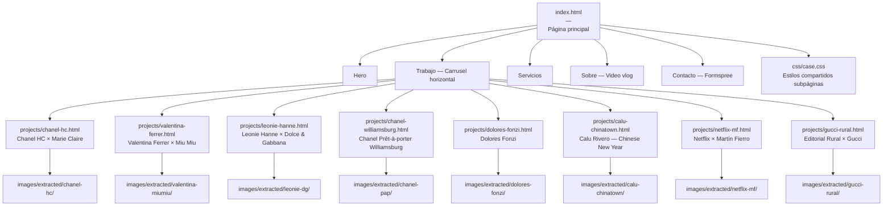

# HANDOFF — ashmateu-web

**Meta:** Portfolio web completo para Ash Mateu (stylist, directora creativa, consultora de moda) en ashmateu.com.

**Estado:** Funcional en servidor local. Pendiente: deploy a producción y activar formulario Formspree.

**Siguiente paso:** Activar Formspree (ver sección Pendientes) y hacer deploy en Netlify o GoDaddy.

---

## Arquitectura del sitio



---

## Estructura de archivos

```
ashmateu-web/
├── index.html                  ← Página principal (todo el CSS inline + JS inline)
├── css/
│   └── case.css                ← Estilos compartidos de las 8 subpáginas editoriales
├── projects/
│   ├── chanel-hc.html
│   ├── valentina-ferrer.html
│   ├── leonie-hanne.html
│   ├── chanel-williamsburg.html
│   ├── dolores-fonzi.html
│   ├── calu-chinatown.html
│   ├── netflix-mf.html
│   └── gucci-rural.html
└── images/
    ├── extracted/              ← Imágenes extraídas de PDFs con pdfimages (calidad original)
    │   ├── chanel-hc/          12 JPEGs
    │   ├── valentina-miumiu/   5 JPEGs
    │   ├── leonie-dg/          10 JPEGs
    │   ├── chanel-pap/         4 JPEGs
    │   ├── dolores-fonzi/      7 JPEGs
    │   ├── calu-chinatown/     6 JPEGs
    │   ├── netflix-mf/         8 JPEGs (baja resolución — redes sociales)
    │   └── gucci-rural/        3 JPEGs
    ├── _xl_scan/               41 thumbnails de escaneo (xl-050 a xl-090, 72 DPI)
    └── netflix-081.jpg         Slide renderizado, usado como hero en netflix-mf.html
```

---

## Decisiones técnicas clave

| Decisión | Razón |
|---|---|
| Todo el CSS inline en index.html | Sitio estático de una sola página, sin build system |
| `pdfimages` para extracción | Calidad original embebida vs re-renderizado con pdftoppm |
| Carrusel horizontal con `overflow-x: scroll` | Sin dependencias, compatible con touch/mouse/trackpad |
| Carrusel auto-scroll con `requestAnimationFrame` | Suave, se pausa en hover/touch, reinicia al llegar al final |
| YouTube facade (img + click → iframe) | El iframe de YT no carga en HTTP local; la portada siempre se ve |
| Formspree para el formulario | Compatible con cualquier hosting estático (no requiere Netlify) |
| Mermaid en este HANDOFF | Gráfico de sitio sin dependencias extra, renderiza en GitHub |

---

## Tokens y paleta de diseño

```css
--black:  #0A0A0A
--ivory:  #F7F3EE
--white:  #FFFFFF
--sand:   #B5A898
--serif:  'Playfair Display', Georgia, serif
--sans:   'Inter', system-ui, sans-serif
--gutter: 56px (desktop) / 24px (mobile)
```

Filtro CSS de imagen: `brightness(0.88) contrast(1.06) saturate(0.78)`

---

## Comportamiento del carrusel

- Auto-scroll: `0.6px/frame` via `requestAnimationFrame`, reinicia al final
- Pausa: al hover (mouse), al touchstart, al clickar flechas
- Reanuda: `1.2–1.5s` después de la última interacción
- Trackpad: gesto horizontal (`|deltaX| > |deltaY|`) → carrusel. Vertical → página
- Touch: detecta dirección en primer `touchmove`, swipe horizontal → carrusel
- Flechas: ocultan con clase `.is-hidden` según posición de scroll
- Loop: `scrollLeft = 0` cuando llega al final

---

## Tareas completadas

- [x] Extraer imágenes de PDFs de campañas (8 editoriales)
- [x] Crear 8 subpáginas editoriales con layout completo (hero, bloques imagen-texto, créditos)
- [x] Rediseñar portfolio como carrusel horizontal inspirado en artandcommerce.com
- [x] Agregar video vlog YouTube (facade + autoplay al click)
- [x] Auto-scroll del carrusel con pausa inteligente
- [x] Scroll horizontal trackpad sin bloquear scroll vertical de página
- [x] Swipe táctil en mobile
- [x] Flechas de navegación con desaparición dinámica
- [x] Nav hamburger para mobile
- [x] Hero mobile corregido (sin espacio vacío excesivo)
- [x] Overlay del carrusel simplificado en mobile (solo título)
- [x] Duplicados de imágenes corregidos en subpáginas
- [x] Formulario de contacto con feedback visual (Formspree)
- [x] Imágenes convertidas a WebP (117 archivos, -21% peso total)
- [x] `loading="lazy"` en todas las imágenes no-hero, `loading="eager" fetchpriority="high"` en heroes
- [x] Meta tags completos en index.html: canonical, og:image, og:type, twitter:card
- [x] Meta tags individuales en las 8 subpáginas (canonical, og, twitter)
- [x] `sitemap.xml` con las 9 URLs del sitio
- [x] `robots.txt` con permisos para AI crawlers (GPTBot, ClaudeBot, PerplexityBot)
- [x] Rediseño Grand Magazine: titular Playfair italic gigante "Ash Mateu" en #sobre (fondo ivory), email+IG en sand small caps en #contacto

---

## Pendientes

### 1. Activar formulario Formspree (5 minutos)

1. Ir a [formspree.io](https://formspree.io)
2. Crear cuenta con `ash.mateu@gmail.com`
3. Crear nuevo formulario, copiar el ID (ej: `xabcdefg`)
4. En `index.html`, reemplazar la línea:
   ```html
   action="https://formspree.io/f/FORMSPREE_ID"
   ```
   por:
   ```html
   action="https://formspree.io/f/xabcdefg"
   ```

### 2. Deploy a producción

**Vercel (preferido):**
1. Crear cuenta en [vercel.com](https://vercel.com)
2. "Add New Project" → "Import from filesystem" (o arrastrar carpeta)
3. En GoDaddy, apuntar los nameservers de `ashmateu.com` a Vercel (Settings → Domains)
4. Alternativa GoDaddy hosting: FTP a `public_html/`

### 3. Mejoras futuras sugeridas
- Menú hamburger mobile con animación de apertura más elaborada
- Subpágina de netflix-mf con imágenes de mayor calidad (las actuales son de redes sociales)
- Versión en inglés del copy para audiencia internacional

---

## Cómo correr localmente

```bash
cd /Users/mariano_rosso/Downloads/ashmateu-web
python3 -m http.server 8080
# Abrir: http://localhost:8080
# Desde el celu (mismo WiFi): http://192.168.0.130:8080
```

---

## Enfoques que NO funcionaron

| Enfoque | Problema |
|---|---|
| `pdftoppm` para extracción de fotos | Re-renderiza como bitmap, pierde calidad vs JPEG original embebido |
| `e.preventDefault()` en todo evento `wheel` | Bloqueaba el scroll vertical de la página con trackpad |
| `justify-content: flex-end` en hero mobile | Creaba espacio vacío enorme arriba del 50% de pantalla |
| iframe YouTube directo en HTTP local | No carga en mobile Chrome por política de mixed content |

---

*Generado: 2026-06-19*
